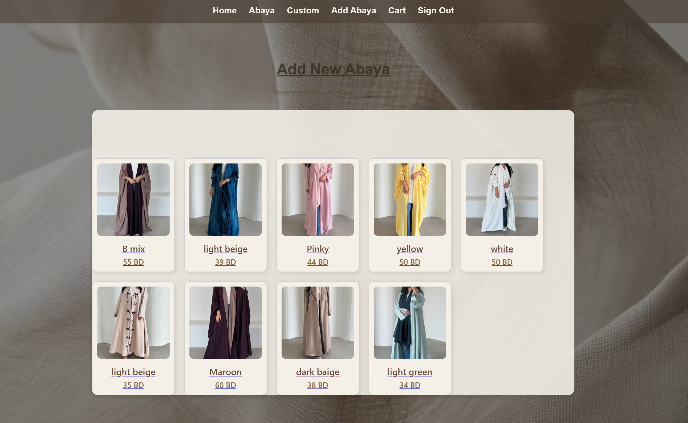
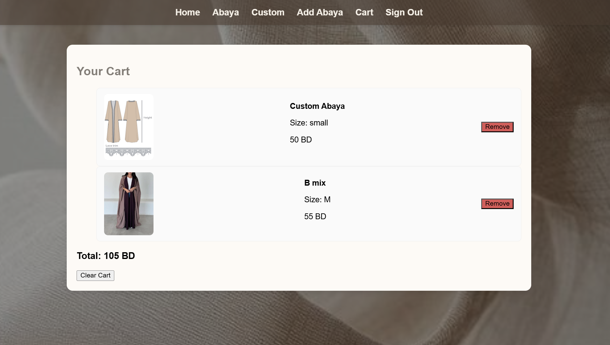

# Abaya Boutique Platform 🧵👗

## 📌 Description
A modern web platform for abayas. Customers can browse and purchase ready-made abayas from merchants or customize their own by selecting fabrics, colors, sizes, and designs, then place orders. The system supports two main roles: **Admin** and **Customer**.

---

## 🛠 Technologies Used
- **Frontend:** React.js,  CSS
- **Backend:** Node.js, Express.js
- **Database:** MongoDB
- **Others:** JWT Authentication, REST API

- Multer (for image uploads)
---

### Here are some details about the implementation of my project

**1. Database Design (ERD)**

This ERD shows the main tables in the project and how they are related to each other  
It shows the main entities such as **Abaya**, **User**, and **Custom**, along with their relationships and key attributes.

You can view the detailed ERD image below or click [here](https://lucid.app/lucidchart/53779120-5de1-41f2-bb80-0602a8f42976/edit?viewport_loc=-1013%2C-115%2C1505%2C811%2C0_0&invitationId=inv_0dd27076-da55-46ac-bed3-4ef75466cb15) to see the full diagram online.

**2 . 📋 Project Planning with Trello**

At the srart of the project, i created a task plan using [Trello](https://trello.com/b/hMG32qiy/abaya-project) , which helped us save time and stay organized.
Trello allowed us to clearly arrange and manage tasks visually, making the development process more efficient — as shown in the image below

 

**3. 🎨 Initial Design with Figma**

After planning, we created a basic design for the project using [Figma](https://www.figma.com/design/3mm4P1kGuKzHKULug1eDOz/Abaya-Boutiqe?node-id=0-1&p=f&t=QyfiFFGWSt4DS2WK-0) .
This step helped us visualize the layout and understand how we wanted the structure and interface of our project to look , as shown in the image below

 

---
## ✨ Features

### 👩‍🦰 Customer
- Browse and purchase ready-made abayas from available.

- Customize abayas by choosing fabric, color, size, and style.

- Add to cart.
 

### 👩‍💼 Admin
- Manage products and customers 

- Add or remove abayas  

### 👁 Live Preview
- See design before ordering  

[Live Demo](https://)

## 📷 Screenshots

### Sign in Page

### Sign up Page

### Home Page

### Abaya List Page

### Customization Page

### Preview Custom image

### The Admin has the ability to add new abayas with images to the abaya list. A button above the abaya list and an Add Abaya option in the navigation bar provide quick access to this feature.

### Admin Navbar

### User Navbar without add link

### Add to Cart Button  

### The Cart allows users to review all their selected abayas in both (ready made) and (custom) and see the total price before proceeding to checkout.

---

## Online Resources

 * [GA](https://generalassembly.instructure.com/) :  it guides me building a MEN (MongoDB, Express.js, Node.js) stack application .
 
 * [npm](https://www.npmjs.com/package/multer) : help me for using multer.

 * [Painterest](https://www.pinterest.com/): ideas and images.

 * [unsplash](https://unsplash.com/photos/a-close-up-of-a-white-sheet-on-a-bed-llpJbIBhhgc): the  bachground in our app and Trello.
